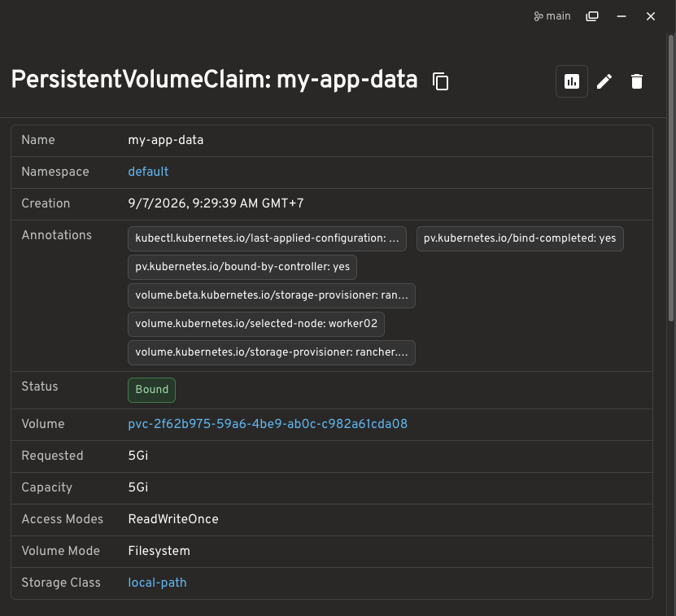
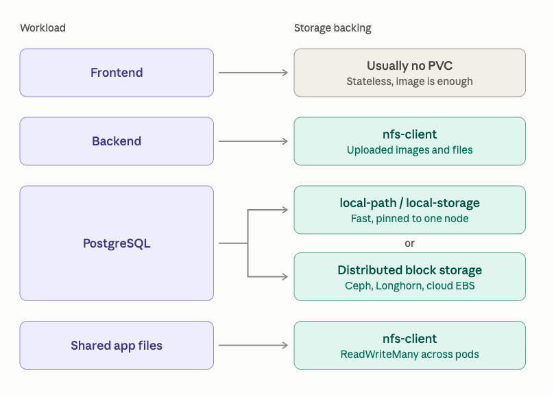
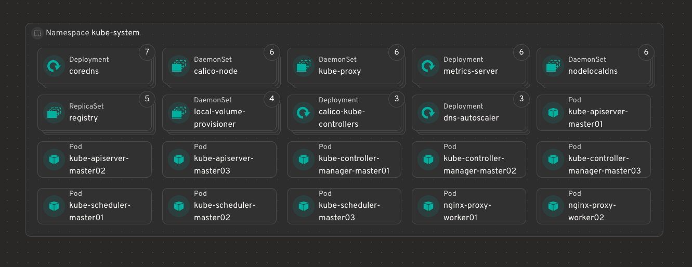
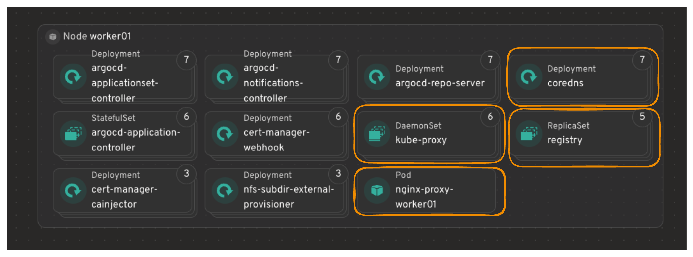
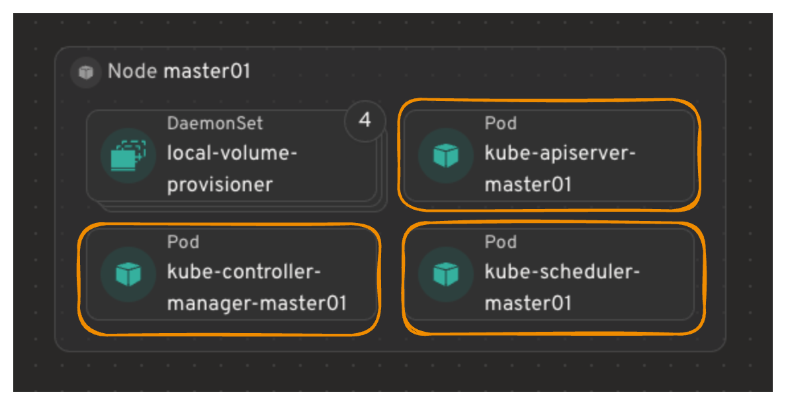

## NOTE 

1. **local-path**: Simple local disk storage on a node, great for single-node K3S/labs
2. **local-storage**: mually managed local PVs tied to a specific node. 
3. **nfs-client**: Shared NFS storage with dynamic PV provisioning, best when multiple nodes/pods need shared persistent storage. 




#### Using Local-Storage 
```bash 
PROVISIONER:
kubernetes.io/no-provisioner
```
> This means: Kubenretes will NOT Automatically create a PV. 
We must create the disk/directory and PV yourself. 
For example, assume our worker has: 
```bash 
/data/postgres
```
Create the directory on the node first. 
```bash 
sudo mkdir -p /data/postgres
sudo chmod 777 /data/postgres
```
Then we create the pvc 
```yaml 
apiVersion: v1
kind: PersistentVolume
metadata:
  name: postgres-local-pv
spec:
  capacity:
    storage: 20Gi
  volumeMode: Filesystem
  accessModes:
    - ReadWriteOnce
  persistentVolumeReclaimPolicy: Delete
  storageClassName: local-storage
  local:
    path: /data/postgres
  nodeAffinity:
    required:
      nodeSelectorTerms:
        - matchExpressions:
            - key: kubernetes.io/hostname
              operator: In
              values:
                - worker01
```
- Create the PVC 
```yaml
apiVersion: v1
kind: PersistentVolumeClaim
metadata:
  name: postgres-data
spec:
  accessModes:
    - ReadWriteOnce
  storageClassName: local-storage
  resources:
    requests:
      storage: 20Gi

```




- Illustration to see component in the node 

