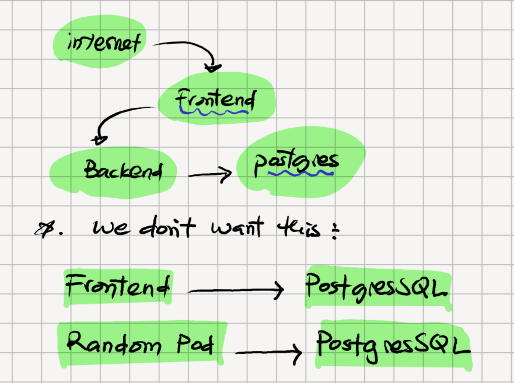
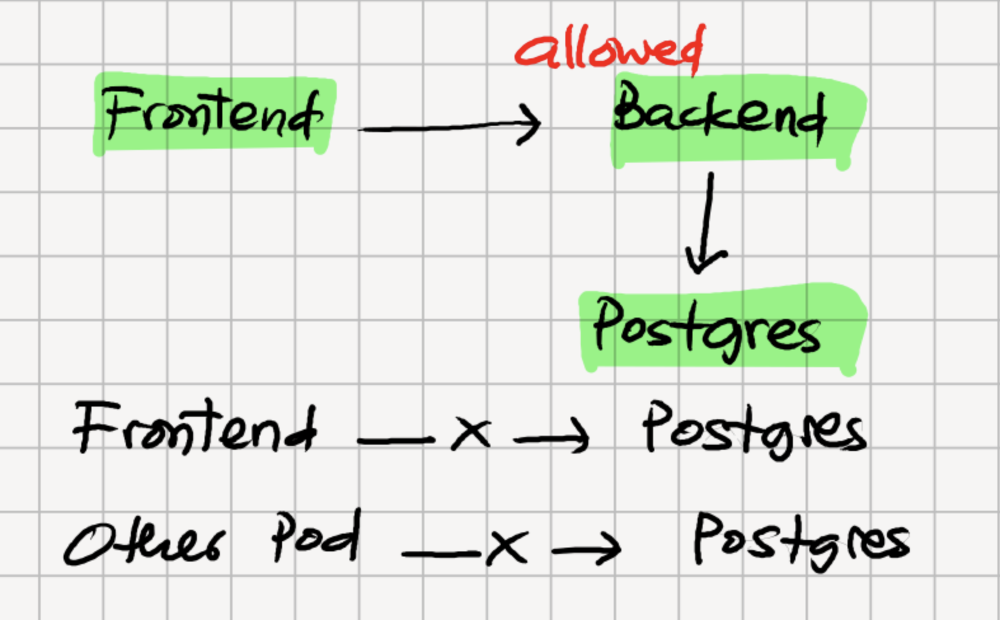

## ADDITIONAL TOPICS FOR KUBERNETES 


Security, Access Control, Networking, Reliability, Production Operations. 

- ServiceAccount
- RBAC 
- NetworkPolicy 
- SecurityContext 
- Pod Security
- ResourceQuota/LimitRange 
- HPA/PDB 
- Admission Control 


### 1. **Network Policy**: 
Control which pods can communicates 
By default, K8S networking is generally very open: if the CNI allows it, Pods can communicate with other Pods. 


```yaml
apiVersion: networking.k8s.io/v1
kind: NetworkPolicy 
metadata: 
  name: postgres-policy 
  namespace: default 

spec: 
  podSelector:
    matchLabels:
      app: postgres 
  policyTypes: 
    - Ingress 
  ingress: 
    - from : 
      - podSelector:
          matchLabels:
            app: backend 
      ports: 
        - protocol: TCP 
          port: 5432 
```
> One Important Default: CNI must support NetworkPolicy enforcement. K8s defines the API, but network plugin enforce it. 


### 2. Default-Deny Network Policy 
producation approach is to start by denying traffic and explicitly allowing what is needed. 

```yaml
apiVersion: networking.k8s.io/v1
kind: NetworkPolicy
metadata:
  name: default-deny
  namespace: production
spec:
  podSelector: {}
  policyTypes:
    - Ingress
    - Egress
```

This essentially establishes : 
```bash
production namespace

┌─────────────────────────────────┐
│                                 │
│ frontend     backend     db     │
│     X           X         X     │
│                                 │
│ Communication denied unless     │
│ explicitly allowed              │
└─────────────────────────────────┘
```
- Then we add the policies for legitimate application flows. 
- This is good concept to teach as : 
Default Deny -> Explicitly Allow Required Communication. 


### 3. ServiceAccount - identity for workloads 
Thsi is one of the most important concept after basic kubernetes 
The ServiceAccount answers: 
> Who is this pod when it talks to the Kubernetes API?

Example: 
Suppose you are building a monitoring application that needs to list Pods. 
- Create an identity 
```yaml 
apiVersion: v1
kind: ServiceAccount
metadata:
  name: pod-reader
  namespace: monitoring

```
Then assign it to pods. 
```yaml
apiVersion: v1
kind: Pod
metadata:
  name: monitoring-app
spec:
  serviceAccountName: pod-reader

  containers:
    - name: app
      image: my-monitor:1.0
```
Conceptually: 
```bash
Pod
 │
 │ uses
 ▼
ServiceAccount
 │
 │ authenticates to
 ▼
Kubernetes API Server
```
But creating the serviceaccount doens't automatically give it useful permissions. 
> That's where RBAC comes in. 

### 4. RBAC - What is ServiceAccount allowed to do?
RBAC stands for : 
Role-Based Access Control 
```bash
ServiceAccount
     │
     │ RoleBinding
     ▼
    Role
     │
     ├── get pods
     ├── list pods
     └── watch pods
```
Create a role
```yaml
apiVersion: rbac.authorization.k8s.io/v1
kind: Role
metadata:
  name: pod-reader
  namespace: monitoring
rules:
  - apiGroups: [""]
    resources: ["pods"]
    verbs:
      - get
      - list
      - watch
```
We bind the serviceaccount to the role
```yaml
apiVersion: rbac.authorization.k8s.io/v1
kind: RoleBinding
metadata:
  name: pod-reader-binding
  namespace: monitoring

subjects:
  - kind: ServiceAccount
    name: pod-reader
    namespace: monitoring

roleRef:
  kind: Role
  name: pod-reader
  apiGroup: rbac.authorization.k8s.io
``` 
Now: 
```bash
Monitoring Pod
      │
      ▼
ServiceAccount: pod-reader
      │
      ▼
RoleBinding
      │
      ▼
Role
      │
      ├── get pods    ✓
      ├── list pods   ✓
      ├── watch pods  ✓
      ├── delete pods ✗
      └── secrets     ✗
```
> This is extremely important in production. 

### 5. Role vs ClusterRole 
These are the two important permssions objects. 
```bash
              RBAC
               │
        ┌──────┴──────┐
        │             │
       Role       ClusterRole
        │             │
   Namespace        Cluster
     scoped           wide
```
For example: 
```bash
Role
 └── can read Pods
     only in namespace "backend"

ClusterRole
 └── can read Nodes
     across the cluster

```
Then we use: 
```bash
Role
     ↓
RoleBinding

ClusterRole
     ↓
ClusterRoleBinding
```


### 6. SecurityContext: Control what a container can do.
> You don't want the application container to run as root.  
```yaml
apiVersion: v1
kind: Pod
metadata:
  name: backend
spec:

  securityContext:
    runAsNonRoot: true
    runAsUser: 1000
    runAsGroup: 1000
    fsGroup: 1000

  containers:
    - name: backend
      image: backend:1.0

      securityContext:
        allowPrivilegeEscalation: false
```        
- We can go further by: 
```yaml
securityContext:
  allowPrivilegeEscalation: false
  readOnlyRootFilesystem: true
  capabilities:
    drop:
      - ALL
```
- The idea is : 
```bash
Container

root                     ✗
privilege escalation     ✗
write root filesystem    ✗
Linux capabilities       minimized

Application              ✓
```

### 7. Pod Security ADMISSION 
- `SecurityContext` configures an individual workload
But what if you want to say
> Every pod in production namespace must follow security rules

Kubernete provide POd Security Admission with security levels such as 
```bash 
Prividleged 
baseline 
Restricted 
```
- For example: 
```bash 
kubectl label namespace production \
  pod-security.kubernetes.io/enforce=restricted
```
> Then Kubernetes can reject workloads that violate the trestricted policy. 
Conceptually: 
```bash
Developer
    │
    │ kubectl apply
    ▼
API Server
    │
    ▼
Pod Security Admission
    │
    ├── Safe Pod ─────────► ACCEPT
    │
    └── Privileged Pod ───► REJECT

```

### 8. Resource request and limits. 
This is essential before running serious workloads. 
```yaml
resources:
  requests:
    cpu: "250m"
    memory: "256Mi"

  limits:
    cpu: "500m"
    memory: "512Mi"
```
They mean different things 
```bash 
requests
   │
   └── Scheduler uses this to decide
       where the Pod can run

limits
   │
   └── Maximum resource usage
       allowed for the container
```      

For example: 
```bash
Node
8 CPU
16 GB RAM

Pod A
request: 2 CPU / 4 GB

Pod B
request: 1 CPU / 2 GB

Scheduler uses requests to determine placement.
```
> CPU and memory limits also behave differently: CPU is generally throttled when constrained, while exceeding a hard memory limit can result in the container being killed for OOM.


### 9. LimitRange 
instead of trusting every development to configure the resource correctly, a namespace can define the default or contraints. 
```yaml 
apiVersion: v1
kind: LimitRange
metadata:
  name: container-limits
  namespace: production
spec:
  limits:
    - type: Container

      defaultRequest:
        cpu: 100m
        memory: 128Mi

      default:
        cpu: 500m
        memory: 512Mi

```
> This is useful in shared cluster 

### 10.Resource Quota 
Suppose you have: 
```bash
Cluster
│
├── team-a
├── team-b
└── team-c
```
We don't want TeamA to have the entire cluster 
We can give the namespace a quota. 
```yaml 

apiVersion: v1
kind: ResourceQuota
metadata:
  name: team-quota
  namespace: team-a
spec:
  hard:
    requests.cpu: "4"
    requests.memory: 8Gi

    limits.cpu: "8"
    limits.memory: 16Gi

    pods: "20"
```
So 
```yaml
Cluster resources
         │
         ├── Team A → quota
         ├── Team B → quota
         └── Team C → quota
```

### Horizontal Pod Autoscaler -HPA 
```bash 
kubectl autoscale deployment backend \
  --cpu-percent=70 \
  --min=2 \
  --max=10

```
HPA is another reason why resource request matter: 
- CPU utilization-based hPA cacluation depends on the CPU requests. 

### 12. PodDisruptionBudget-PDB 
Image your application has three replicas 
```bash
backend: 
Pod1 
Pod2 
Pod3 
```


During the voluntary disruptions ushc as node maintainance, you may want to at lease two avaialble. 
```yaml 
apiVersion: policy/v1
kind: PodDisruptionBudget
metadata:
  name: backend-pdb
spec:

  minAvailable: 2

  selector:
    matchLabels:
      app: backend
```      
Desired Behavior. 
```bash 
3 pods 
Node maintainance 

POd1 -> unvaialble
Pod2 -> running 
Pod3 -> running 

Min Available = 2 
```
> PDBs primarily product against the voluntary disruptions; they can't a guanrantee against node crashes or other involuntary failure. 

### 13. PriorityClass 
Sometimes some application are more important than other. 
```bash
Critical:
DNS
Monitoring
Ingress Controller

Normal:
Backend
Frontend

Low:
Batch processing
Development workloads
```
- We can create a priority classses 
```yaml 
apiVersion: scheduling.k8s.io/v1
kind: PriorityClass
metadata:
  name: production-critical

value: 100000

globalDefault: false

description: "Critical production workloads"

```
Then : 
```yaml 
spec:
  priorityClassName: production-critical
```
> This influences K8s Scheduling and, when necessary, preemption. 

### 14. Admission Controller / Admission Webhooks 
This is more advanced topic 
Image someone submit: 
```bash
kubectl apply -f deployment.yaml 
```
The request doens't necessarily go straight into the cluster unchanged 
Conceptually 
```bash
kubectl
   │
   ▼
API Server
   │
   ▼
Authentication
   │
   ▼
Authorization / RBAC
   │
   ▼
Admission
   │
   ├── Validate
   │
   └── Mutate
   │
   ▼
etcd
```
Admission policies / webhooks can enforce things such as: 
```bash
"Every container must have resource limits."

"Don't allow privileged containers."

"Only approved registries may be used."

"Every Deployment must have required labels."
```
> this become important when managing larger organizations. 

### 15. CRD and Operators 
This one of the most powerful advanced kubernetes concepts. 

Kubenretes nromally understand objects such as: 
```bash
POD,DEPLOYMENT,SERVICE,SECRETS,CONFIGMAP
```
CRD(CustomResourceDefinition) lets you extend kubenretes with new resources types. 

```yaml 
apiVersion: database.example.com/v1
kind: PostgreSQL
metadata:
  name: production-db
spec:
  replicas: 3
  storage: 100Gi
```
K8S itself doens't inherently know how to build that postgresql cluster. 
An Operator watches that resources. 
```bash
Custom Resource

PostgreSQL
    │
    ▼
Operator
    │
    ├── create StatefulSet
    ├── create PVC
    ├── configure replication
    ├── handle failover
    ├── backup
    └── upgrade
```
## RECAPs
ServiceAccount + RBAC — workload identity and permissions
NetworkPolicy — Pod-to-Pod security
SecurityContext — secure the container
Pod Security Admission — enforce security at namespace level
Requests/Limits + LimitRange + ResourceQuota — resource management
HPA — autoscaling
PDB — application availability during maintenance
PriorityClass — workload importance
Admission policies/webhooks — cluster-wide governance
CRD + Operators — extending Kubernetes