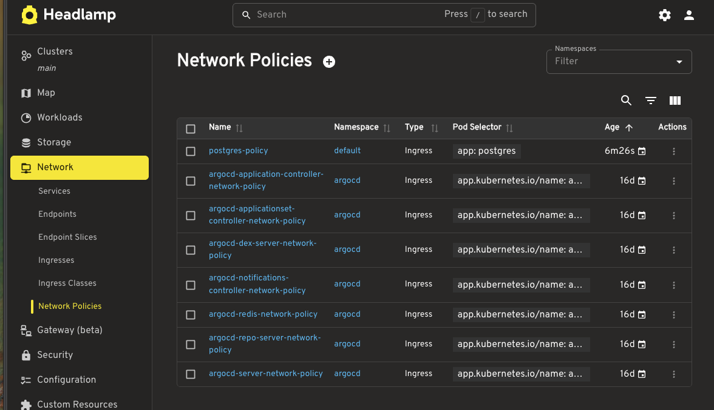
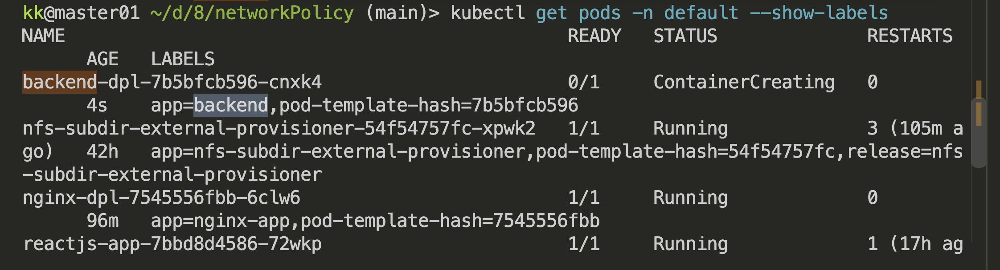
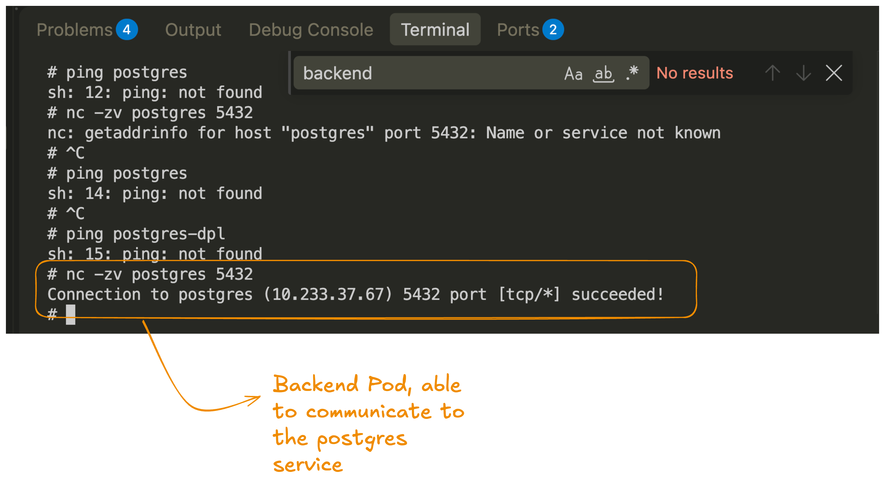
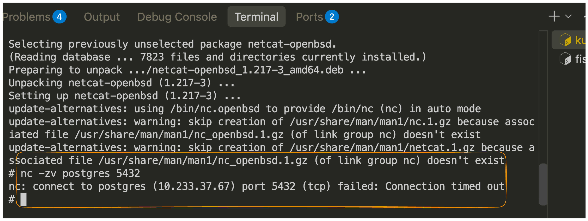

```bash 
kubectl get pods -n default --show-labels 
```

> Only the pod with the backend label able 

### TESTING FROM BACKEND PODS 
```bash
kubectl exec -it -n default backend-dpl-7b5bfcb596-cnxk4  -- sh 

# test it 
apt update
apt install netcat-openbsd 
nc -zv postgres 5432
```


```bash
kubectl run backend-test \
  -n production \
  --image=nicolaka/netshoot \
  --labels="app=backend" \
  --restart=Never \
  -it --rm -- bash

```

