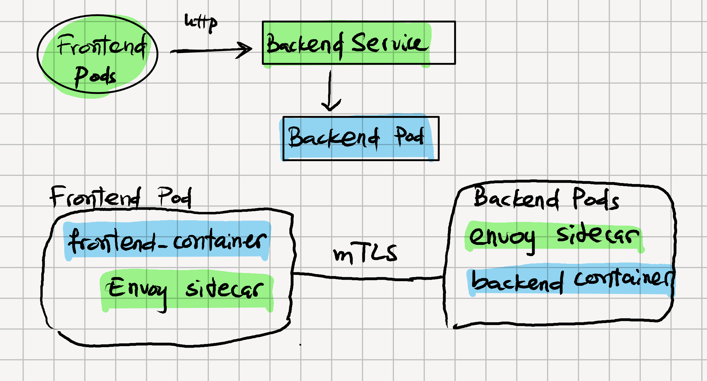
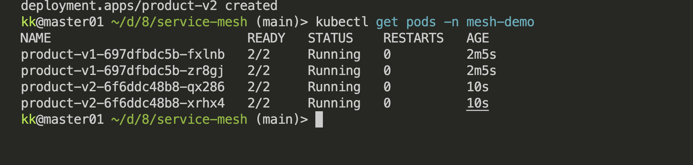
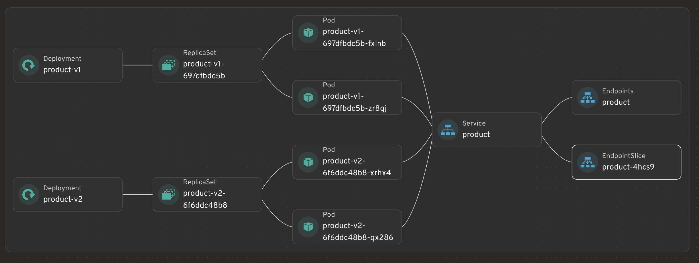

## NOTE RELATED TO THE SERVICE MESH 


Service mesh is an extra networking layer for k8s that manage service-to-service communication inside the cluster. 
K8s (service) give you discovery and loadbalancing; a servicemesh adds things like **mTLS, retries , traffic splitting, observability, access control , and failure handlings**. 


- installing the istio with helm 
```bash
helm repo add istio https://blob.istio.io/istio-release/charts
helm repo update


helm install istio-base \
    istio/base -n istio-system \
    --set defaultRevision=default --create-namespace


helm status istio-base -n istio-system
helm get all istio-base -n istio-system

helm install istiod istio/istiod -n istio-system --wait


# Optional , ingress gateway 
kubectl create namespace istio-ingress
helm install istio-ingress istio/gateway -n istio-ingress --wait

```
- installing the cli 
```bash
curl -L https://istio.io/downloadIstio | sh
cd istio-*
export PATH=$PWD/bin:$PATH

istioctl version 
```

- Install 
```bash
istioctl install --set profile=demo -y
# to verify the installations 
kubectl get pods -n istio-system
```
```bash
NAME                                    READY   STATUS    RESTARTS   AGE
istio-egressgateway-86c9d87669-mwvp5    1/1     Running   0          51s
istio-ingressgateway-6cf56f985f-5zml6   1/1     Running   0          51s
istiod-5dd4b9f85b-prptl                 1/1     Running   0          28s
istiod-5dd4b9f85b-slfv9                 1/1     Running   0          63s
```

```bash 
# create the namespace 
kubectl create namespace mesh-demo

# to enable the auto sidecar injection 
kubectl label namespace mesh-demo istio-injection=enabled
# checkings 
kubectl get namespace mesh-demo --show-labels
```



- When we apply the `product-svc.yaml` 
Both deployment have 
```yaml 
app: product
```
k8s service see both 
`product-v1` 
`product-v2` 
kubenetes may distributes the request to both deployments. 

- after applying the test-client.yaml 

```bash
kubectl exec -it -n mesh-demo deploy/client -c client -- sh
```
```bash
~ $ curl product
PRODUCT VERSION 2
~ $ curl product
PRODUCT VERSION 2
~ $ curl product
PRODUCT VERSION 1
~ $ curl product
PRODUCT VERSION 1
~ $ curl product
PRODUCT VERSION 1
~ $ curl product
PRODUCT VERSION 2
~ $ curl product
PRODUCT VERSION 1
~ $ curl product
PRODUCT VERSION 2
~ $ curl product
PRODUCT VERSION 2
~ $ curl product
PRODUCT VERSION 2
~ $ curl product
PRODUCT VERSION 2
~ $ curl product
PRODUCT VERSION 2
~ $ curl product
PRODUCT VERSION 2
~ $ curl product
PRODUCT VERSION 1
~ $ curl product
PRODUCT VERSION 2
~ $ curl product
PRODUCT VERSION 2
~ $ curl product
PRODUCT VERSION 2
```
- Let the ISTIO adding the rule (DestinationRule)
> destinationrule define a group of pod called subset. 
```yaml
apiVersion: networking.istio.io/v1
kind: DestinationRule
metadata:
  name: product
  namespace: mesh-demo
spec:
  host: product

  subsets:
    - name: v1
      labels:
        version: v1

    - name: v2
      labels:
        version: v2
```
the important path: 

v1 -> pods labeled version=v1
v2 -> pods labeled version=v2

- ISTIO VIRTUALSERVICE 
this is related to controlling the services traffic 

Initially send the request 100% -> V1 
```bash
kubectl exec -it -n mesh-demo deploy/client -c client -- sh

# Inside the container , run this to test 
for i in $(seq 1 10); do curl product; echo; done
```
- We should see the same output:
```bash
PRODUCT VERSION 1
PRODUCT VERSION 1
PRODUCT VERSION 1
PRODUCT VERSION 1
PRODUCT VERSION 1
PRODUCT VERSION 1
PRODUCT VERSION 1
PRODUCT VERSION 1
PRODUCT VERSION 1
PRODUCT VERSION 1
```

### Canary Deployments
```bash
90% users -> v1
10% users -> v2
```
Change the weight to the version1 = 90% , change weight to version2 = 10% 

Go through the same process of testing again 
```bash
PRODUCT VERSION 1
PRODUCT VERSION 1
PRODUCT VERSION 1
PRODUCT VERSION 1
PRODUCT VERSION 1
PRODUCT VERSION 1
PRODUCT VERSION 1
PRODUCT VERSION 1
PRODUCT VERSION 2
PRODUCT VERSION 1
```
### Blue/Green Deployment 
change 100 -> v1 
Change 0 -> v2 

change  0 -> V1 
Change 100 -> v2 

### RETRY
Suppose our backend sometimes, we can do this from the frontend side. 
```bash
try request
if failure
    retry
```
Istio can handle : 
```yaml 
apiVersion: networking.istio.io/v1
kind: VirtualService
metadata:
  name: product
  namespace: mesh-demo
spec:
  hosts:
    - product

  http:
    - retries:
        attempts: 3
        perTryTimeout: 2s

      route:
        - destination:
            host: product
            subset: v1
```
Meaning: 
```bash
Frontend
   |
request
   |
Envoy
   |
   +--> product
          |
        failure
          |
          retry
          |
          retry
```
> Application doens't need to retries itself. 


### Timeout 
if the backend take longer than 3s , the request will become timeout 
```yaml 
http:
  - timeout: 3s

    route:
      - destination:
          host: product
          subset: v1
```
> Preventing the request to hanging forever 

### Fault Injections 
> Useful for testing the microservices 
FOr example, artifically adding the delay for 20% of the request 
```yaml 
http:
  - fault:
      delay:
        percentage:
          value: 20
        fixedDelay: 5s

    route:
      - destination:
          host: product
          subset: v1
```
Meaning: 
```bash
100 requests

80 requests -> normal
20 requests -> delayed 5 seconds
```
You can test whether the frontend handles slow dependencies correctly.
You can also inject HTTP errors:
```bash
fault:
  abort:
    percentage:
      value: 10
    httpStatus: 500
```
Meaning 
```bash
10% -> HTTP 500
90% -> normal
```
> useful for resilient testings. 
### mTLS

Another major service-mesh feature is service-to-service encryption.

Without mTLS:
```bash
frontend --------HTTP--------> backend
```
With Istio 
```bash
frontend Envoy
      |
      | encrypted mTLS
      |
backend Envoy
```
Application continue to use 
```bash
curl http://product 
```
> while Istio encrypts the network traffic underneath.

We can enforce the strict mTLS 
```yaml
apiVersion: security.istio.io/v1
kind: PeerAuthentication
metadata:
  name: default
  namespace: mesh-demo

spec:
  mtls:
    mode: STRICT
```

### Authorization 
Suppose we have 
```bash
frontend
backend
postgres
```

We want : 
```bash
frontend -> backend      allowed
frontend -> postgres     denied

backend -> postgres      allowed
```
Istio can enforce service identity policies.

For example, only allow requests from a specific service account.

Conceptually:
```bash
Frontend ServiceAccount
         |
         | allowed
         v
      Backend
         |
         | allowed
         v
      Postgres


random-pod
   |
   X
 Backend
```
This is one reason Kubernetes ServiceAccount becomes much more important when learning service mesh.

### ServiceAccount + ServiceMesh 
```yaml
apiVersion: v1
kind: ServiceAccount
metadata:
  name: frontend-sa
  namespace: mesh-demo

```
- frontend 
```yaml 
spec:
  serviceAccountName: frontend-sa
  ```
Istio can use that workload identity.

Instead of saying:
```bash
allow IP 10.42.2.15
```
you can effectively create policies based on:
```bash
allow identity:
frontend-sa
```
This is much safer because Pod IP addresses change constantly.


### Alerts and Monitoring 
A service mesh can automatically collect information like:
```bash
frontend -> product
requests/sec: 120

success rate: 99.2%

P50 latency: 30ms
P95 latency: 170ms
P99 latency: 420ms

HTTP 200: 98%
HTTP 500: 2%
```
Common tools around istios 
```bash 
Prometheus
Grafana
Jaeger
Kiali
```
Kiali is especially useful for teaching because it can visually show:
```bash
                    ┌── product-v1
frontend ─ product ─┤
                    └── product-v2
```
> with traffic percentage and errors 

### K8s object vs istio object
- kubernetes object 
```bash
Deployment
Service
ConfigMap
Secret
Ingress
NetworkPolicy
ServiceAccount
```
- istio object 
```bash
VirtualService
DestinationRule
Gateway
PeerAuthentication
AuthorizationPolicy
ServiceEntry
```
useful mental models
```bash
Kubernetes
    |
    | creates applications
    |
Deployments / Pods / Services
    |
    v
Service Mesh
    |
    | controls communication
    |
Routing / Security / Resilience / Observability
```
