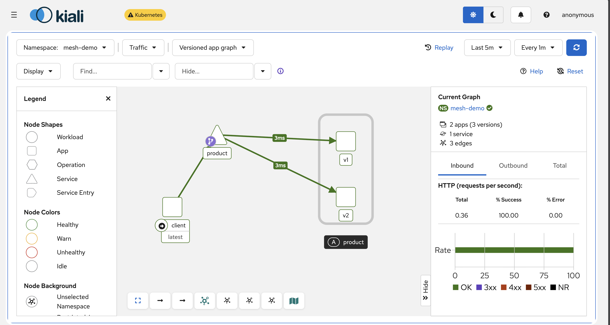

```bash 
export PATH=$PWD/bin:$PATH
```

- simulate the traffic 
```bash 
for i in $(seq 1 100); do
  kubectl exec -n mesh-demo deploy/client -c client -- \
    curl -s http://product
done
```
- Inside UI of the Kaili 
```bash
Kiali
  → Traffic Graph
  → Namespace: mesh-demo
```




Yes. Since you already have **Headlamp**, the tool I’d add specifically for service mesh visualization is **Kiali**.

Headlamp and Kiali overlap a little, but they solve different problems. Headlamp is mainly a Kubernetes dashboard: Pods, Deployments, Services, namespaces, logs, resources, and general cluster operations. Kiali is specifically built as a console for **Istio service mesh**, with traffic topology, service-to-service relationships, request rates, errors, latency, mTLS status, and Istio configuration validation. ([kiali.io][1])


With the example we discussed, Kiali can show something conceptually like:

```text
                  ┌─────────────┐
                  │   client    │
                  └──────┬──────┘
                         │
                         │ HTTP
                         ▼
                  ┌─────────────┐
                  │   product   │
                  │   Service   │
                  └──────┬──────┘
                         │
                 VirtualService
                    90% / 10%
                       /   \
                      /     \
                     ▼       ▼
             ┌──────────┐ ┌──────────┐
             │product-v1│ │product-v2│
             └──────────┘ └──────────┘
```

But instead of being a static diagram, Kiali builds this graph from actual Istio telemetry. You can click nodes and connections to inspect metrics, traffic health, response codes, and other mesh information. Istio's documentation specifically recommends Kiali for visualizing mesh topology. ([Istio][2])

For your cluster, I would use this combination:

```text
                        Kubernetes Cluster
                               │
        ┌──────────────────────┼──────────────────────┐
        │                      │                      │
        ▼                      ▼                      ▼
    Headlamp                 Kiali               Prometheus
        │                      │                      │
 Kubernetes resources     Service Mesh           Metrics
 Pods                    Traffic graph
 Deployments             mTLS status
 Services                Routing
 Secrets                 Errors
 ConfigMaps              Latency
 Nodes                   Istio config
```

So when teaching or troubleshooting:

```text
Headlamp
   ↓
"Is my Deployment running?"
"Where is my Pod?"
"Is my Service correct?"
"Are there events/errors?"

Kiali
   ↓
"Who is talking to whom?"
"Is traffic reaching v1 or v2?"
"Is mTLS enabled?"
"Why are requests failing?"
"How much traffic goes to each version?"
```

### Installing Kiali

If you've already installed Istio with `istioctl`, first find your Istio directory:

```bash
cd istio-*
```

Istio currently provides an add-on installation for Kiali. For a learning environment you can install Prometheus and Kiali with:

```bash
kubectl apply -f samples/addons/prometheus.yaml

kubectl apply -f samples/addons/kiali.yaml
```

Wait for Kiali:

```bash
kubectl rollout status deployment/kiali \
  -n istio-system
```

Check:

```bash
kubectl get pods -n istio-system
```

You should see something similar to:

```text
istiod-xxxxx       1/1   Running
kiali-xxxxx        1/1   Running
prometheus-xxxxx   2/2   Running
```

The Istio quick-start add-on YAML is intended primarily for demonstrations; Istio recommends using Kiali's customizable installation approach for production. ([Istio][3])

Then open it locally:

```bash
istioctl dashboard kiali
```

That normally opens something like:

```text
localhost:20001
```

in your browser. ([Istio][2])

### Important: Kiali needs traffic

A common beginner issue is installing Kiali and seeing an empty graph.

Kiali doesn't simply look at your YAML and draw a diagram. Its traffic graph is generated from **actual Istio telemetry**. ([Istio][2])

For example:

```bash
for i in $(seq 1 100); do
  kubectl exec -n mesh-demo deploy/client -c client -- \
    curl -s http://product
done
```

Then go to:

```text
Kiali
  → Traffic Graph
  → Namespace: mesh-demo
```

Now you should start seeing:

```text
client
  │
  │ requests
  ▼
product
  ├────90%────> product-v1
  │
  └────10%────> product-v2
```

If you've enabled:

```yaml
weight: 90
```

and:

```yaml
weight: 10
```

you can actually observe that distribution rather than only reading it from YAML.

Kiali can also expose the security state of connections, including mTLS. Istio's current documentation shows that you can enable the Security display in the traffic graph to inspect encrypted mesh connections. ([Istio][4])

For example:

```text
frontend
   │
   │ 🔒 mTLS
   ▼
product
   │
   │ 🔒 mTLS
   ▼
database
```

That makes concepts such as `PeerAuthentication` much easier to teach.

I'd therefore keep **both** on your K3s environment:

```text
                Your Kubernetes Lab

                     Browser
                        │
           ┌────────────┴────────────┐
           │                         │
           ▼                         ▼
       Headlamp                    Kiali
           │                         │
           │                         │
 Kubernetes administration     Istio visualization
           │                         │
 Pods                        Traffic topology
 Deployment                  mTLS
 Services                    Latency
 ConfigMaps                  Errors
 Secrets                     Request rate
 Jobs                        Canary traffic
 Nodes                       Istio policies
```

And once you're comfortable with those, add **Grafana + Prometheus + Jaeger/OpenTelemetry**. Then you get a very complete teaching stack:

```text
Headlamp     → Kubernetes resources
Kiali        → service relationships / mesh
Prometheus   → metrics collection
Grafana      → dashboards and graphs
Jaeger/OTel  → distributed request tracing
```

For example, if this happens:

```text
Frontend
   │
   ▼
Backend
   │
   ▼
Database
```

and a request takes **2.8 seconds**, Kiali helps you see the service relationships, Grafana helps you spot latency trends, and tracing can show something like:

```text
Request total: 2.8s

Frontend
████ 200ms

Backend
████████ 400ms

Database
████████████████████████████████████ 2.2s
```

So you can identify that the database call is where most of the time is being spent.

For the Kubernetes topics you're currently working through, **Headlamp + Kiali + Prometheus** is probably the best next step before adding the rest of the observability stack.

[1]: https://kiali.io/?utm_source=chatgpt.com "Kiali"
[2]: https://istio.io/latest/docs/tasks/observability/kiali/?utm_source=chatgpt.com "Istio / Visualizing Your Mesh"
[3]: https://istio.io/latest/docs/ops/integrations/kiali/?utm_source=chatgpt.com "Istio / Kiali"
[4]: https://istio.io/latest/docs/ambient/getting-started/secure-and-visualize/?utm_source=chatgpt.com "Istio / Secure and visualize the application"
